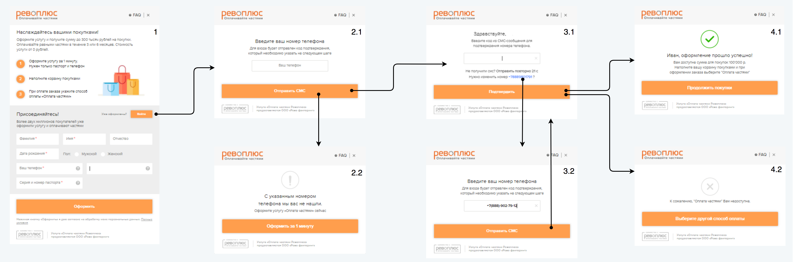
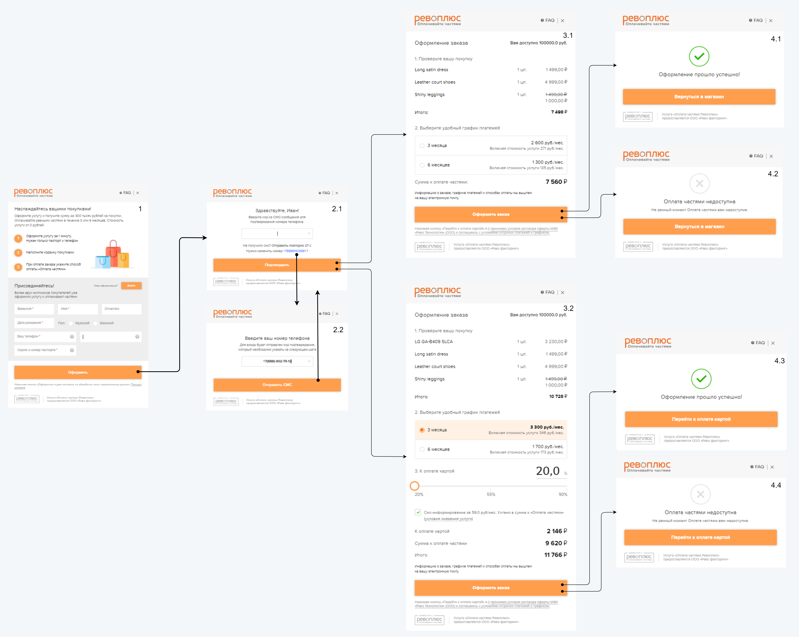
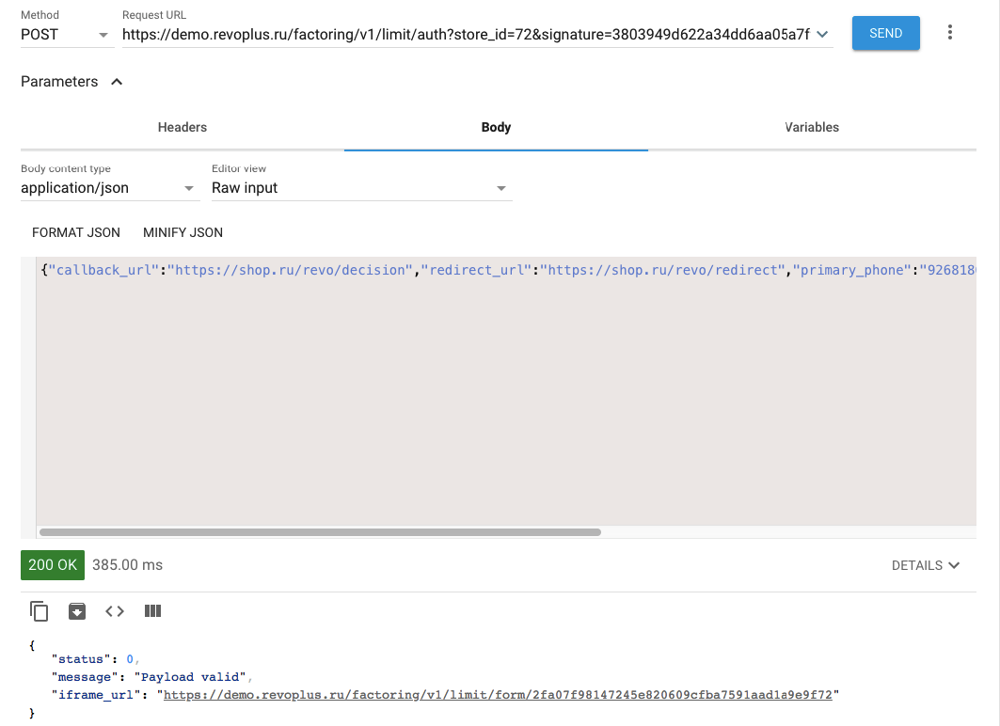
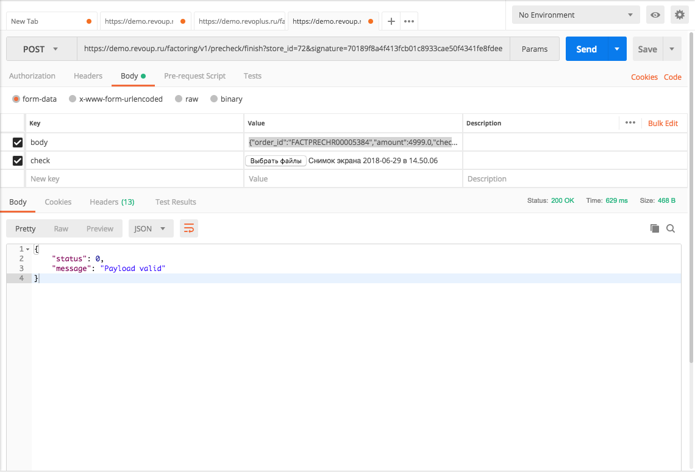
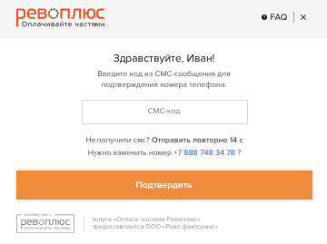

# Introduction

API Factoring is based on the HTTPS protocol with JSON queries.

The documentation consists of 4 main parts:


* Authorization description, <a href="#api">API methods</a> and <a href="#cb76858662">error codes</a>.
* <a href="#iframe-revo">Revo iFrame description</a>.
* <a href="#5a291e242a">Visualisation on a partner website</a>.
* <a href="#db947828e5">Test manual</a>.

# Authorization

## Base URL addresses

```javascript
BASE_URL = "https://r.revoplus.ru/"
BASE_URL = "https://demo.revoplus.ru/"
```

1. To interact with Revo services, two base addresses are used:
 * https://r.revoplus.ru/ - the `production` address of the service.
 * https://demo.revoup.ru/ - the `demo` address of the service.
2. `BASE_URL` - переменная обозначающая базовый адрес.

<aside class="notice">
The connection shall be made only via HTTPS protocol - when trying to connect via HTTP, 404 error will occur.
</aside>

## Authorization parameters

> Parameters example

```javascript
secret_key = "098f6bcd4621d373cade4e832627b4f6"
STORE_ID1 = 12
STORE_ID2 = 13
```

1. On Revo’s side a unique store identifier and a secret key are generated, which are transferred to the partner:
 * `store_id` - unique store identifier. In most cases, at least two unique identifiers are generated: `STORE_ID1` is used for `Registration` and `Limit` methods. `STORE_ID2` - for all the other methods.
 * `secret_key` - a secret key used when generating the digital signature for authentication of query parameters to protect the form from being launched by third parties. Key length is 8 bytes. Encryption algorithm is SHA1.
2. For authorization, the partner sends POST query, using digital signature and unique store identifier `store_id`.
3. Examples of URL queries can be found in <a href="#api">API Methods</a> section.

## Digital signature generation

> Algorithm of digital signature generation

```ruby--tab
require 'digest/sha1'
secret_key = '9fff8c602b08b00323567be0001480f6'
data = "{\"order_id\": \"FACTPRECHR152632\", \"amount\": \"8300.00\"}"
SIGNATURE = Digest::SHA1.hexdigest(data + secret_key)
```

> The result of the encryption in the above example is "cbfb21630cd585f59c3a50fc3365d8c26b97cd4e".

```java
import java.io.UnsupportedEncodingException;
import java.security.MessageDigest;
import java.security.NoSuchAlgorithmException;
import java.util.Formatter;

public class Main {

    static String secret_key = "098f6bcd4621d373cade4e832627b4f6"; // Это пример
    static String data = "{\"callback_url\":\"https://shop.ru/revo/decision\",\"redirect_url\":\"https://shop.ru/revo/redirect\",\"current_order\":{\"sum\":\"7500.00\",\"order_id\":\"R001233\"},\"primary_phone\":\"9268180621\"}";

    public static void main(String[] args) {

        String signature = encryptPassword(data + secret_key); // Тут всегда будет 40 символов по SHA1
        System.out.println(signature);
    }

    private static String encryptPassword(String password) {
        String sha1 = "";
        try {
            MessageDigest crypt = MessageDigest.getInstance("SHA-1");
            crypt.reset();
            crypt.update(password.getBytes("UTF-8"));
            sha1 = byteToHex(crypt.digest());
        } catch(NoSuchAlgorithmException e) {
            e.printStackTrace();
        } catch(UnsupportedEncodingException e) {
            e.printStackTrace();
        }
        return sha1;
    }

    private static String byteToHex(final byte[] hash) {
        Formatter formatter = new Formatter();
        for (byte b : hash) {
            formatter.format("%02x", b);
        }
        String result = formatter.toString();
        formatter.close();
        return result;
    }
}
```

A secret key `secret_key` is added to the data string in json format. SHA1 algorithm is then used to the generate a string which forms a digital `signature`.

<aside class="notice">
Please note, that the signature length will always be 40 symbols according to SHA1.
</aside>

# API Methods

## Registration

```ruby
POST BASE_URL/factoring/v1/limit/auth?store_id=STORE_ID1&signature=SIGNATURE
```

The method returns a reference to the iFrame in order to get the client's limit. Upon completion of the form a json response with information about client's limit is sent to the address specified in `callback_url`.

Depending on the information about the user in the Revo system the form will have a different number of steps (`primary_phone` has to be specified) - see more info on <a href="#iframe-revo">REVO iFrame description</a>.

<aside class="success">
If the client fills in the personal data on the partner's website, it shall be sent in the query for autocompletion of the corresponding form fields.
</aside>

### Parameters

> Json query example

```jsonnet
{
  "callback_url": "https://shop.ru/revo/decision",
  "redirect_url": "https://shop.ru/revo/redirect",
  "primary_phone": "9268180621",
  "primary_email": "ivan@gmail.com",
  "current_order":
  {
    "order_id": "R001233"
  },
  "person":
  {
    "first_name": "Петр",
    "surname": "Чернышев",
    "patronymic": "Александрович",
    "birth_date": "15.01.1975"
  }
}
```

| | | |
-:|-:|:-|:-
 |**callback_url**<br> <font color="#939da3">string</font> | <td colspan="2"> URL for Revo response with information about client's limit.
 |**redirect_url**<br> <font color="#939da3">string</font>	| <td colspan="2"> URL for redirecting upon clicking the button "Return to online store” in the Revo form.
 |**current_order**<br> <font color="#939da3">object</font> | <td colspan="2"> The object containing information about the order.
<td colspan="2" style="text-align:right">**order_id**<br> <font color="#939da3">string</font> | | Unique order number. Maximum 255 characters. A unique random string can be used.
 |**primary_phone**<br> <font color="#939da3">string, *optional*</font> | <td colspan="2"> Client’s phone number consisting of 10 digits (omitting the country code).
 |**primary_email**<br> <font color="#939da3">string, *optional*</font> | <td colspan="2"> Client’s email.
 |**person**<br> <font color="#939da3">object, *optional*</font> | <td colspan="2"> The object containing information about the client.
  <td colspan="2" style="text-align:right">**first_name**<br> <font color="#939da3">string, *optional*</font> | |	Client’s name.
  <td colspan="2" style="text-align:right">**surname**<br> <font color="#939da3">sring, *optional*</font> | | Client’s surname.
  <td colspan="2" style="text-align:right">**patronymic**<br> <font color="#939da3">string, *optional*</font> | | Client's patronymic.
  <td colspan="2" style="text-align:right">**birth_date**<br> <font color="#939da3">object, *optional*</font> | | Client’s birth date in `dd.mm.yyyy` format.

### Response Parameters

> Response example in case of successful authentication.

```jsonnet
{
  "status": 0,
  "message": "Payload valid",
  "iframe_url": "https://r.revoplus.ru/form/v1/af45ef12f4233f"
}
```

 | |
-:|:-
**status**<br> <font color="#939da3">integer</font> | Response code.
**message**<br> <font color="#939da3">string</font> | A short text description of the response.
**iframe_url**<br> <font color="#939da3">string</font>| URL for the generated iFrame.

<a name="callback_url"></a>
### callback parameters

> Callback example in case of successful authentication.

```jsonnet
{
  "order_id": "32423",
  "decision": "approved",
  "amount": 5000.00,
  "mobile_phone": "89262341793",
  "email": "ivan@gmail.com"
}
```

 | |
-:|:-
**order_id**<br> <font color="#939da3">string</font> | Unique order number. Maximum 255 characters.
**decision**<br> <font color="#939da3">string</font> | Decision on instalments. In case of positive decision - `approved` (the order is waiting to be finalized). In case of negative decision - `declined`.
**amount**<br> <font color="#939da3">float</font> | Amount in rubles.
**mobile_phone**<br> <font color="#939da3">string</font> | Client’s phone number consisting of 10 digits (omitting the country code).
**email**<br> <font color="#939da3">string</font> | Client's email.

<aside class="success">
If `decision` is equal to `declined` the `amount` value will be zero.
</aside>

## Limit

```ruby
POST BASE_URL/api/external/v1/client/limit?store_id=STORE_ID1&signature=SIGNATURE
```

The method for obtaining the client’s limit amount using his phone number. Not applicable for new customers.

### Parameters

> Json query example

```jsonnet
{
  "client":
  {
    "mobile_phone": "9031234567"
  }
}
```

 | |
-:|:-
**client**<br> <font color="#939da3">object</font> | The object containing information about the client.
**mobile_phone**<br> <font color="#939da3">string</font> | Client’s phone number consisting of 10 digits (omitting the country code).

### Response Parameters

> Response example in case of a returning customer

```jsonnet
{
  "meta":
  {
    "status": 0,
    "message": "Payload valid"
  },
  "client":
  {
    "mobile_phone": "9031234567",
    "limit_amount": "9500.00",
    "status": "active"
  }
}
```

> Response example in case of a returning customer with installments products unavailable

```jsonnet
{
  "meta":
  {
    "status": 0,
    "message": "Payload valid"
  },
  "client":
  {
    "mobile_phone": "9031234567",
    "limit_amount": "6700.00",
    "status": "inactive"
  }
}
```

> Response example in case of a new customer

```jsonnet
{
  "meta":
  {
    "status": 0,
    "message": "Payload valid"
  },
  "client":
  {
    "mobile_phone": "9031234567",
    "limit_amount": "0.00",
    "status": "new"
  }
}
```

| | | |
-:|-:|:-|:-
 |**status**<br> <font color="#939da3">integer</font> | <td colspan="2"> Response code.
 |**message**<br> <font color="#939da3">string</font> | <td colspan="2"> A short text description of the response.
 |**client**<br> <font color="#939da3">object</font> | <td colspan="2"> The object containing information about the client.
 <td colspan="2" style="text-align:right">**mobile_phone**<br> <font color="#939da3">string</font> | | Client’s phone number consisting of 10 digits (omitting the country code).
 <td colspan="2" style="text-align:right">**limit_amount**<br> <font color="#939da3">string</font> | | The amount of funds available to the client in rubles.
 <td colspan="2" style="text-align:right">**status**<br> <font color="#939da3">string</font> | | User status. Possible values:<br>`active` - the installments product is available to the user; <br>`inactive` - the installments product is unavailable to the user;<br>`new` - a new user with installments product available.


## Checkout
```ruby
POST BASE_URL/factoring/v1/precheck/auth?store_id=STORE_ID2&signature=SIGNATURE
```

Метод возвращает ссылку на iFrame для оформления заказа клиента. По завершению формы на адрес указанный в `callback_url` отправляется <a href="#callback_url">json ответ</a> с результатом оформления. В случае успешного оформления, средства в размере `amount` холдируются на счёте клиента в системе Рево.

В зависимости от информации, которая есть о пользователе в системе Рево, форма будет иметь различное число шагов (для этого нужно передавать `primary_phone`) - см. <a href="#iframe-revo">Описание iFrame REVO</a>.

Для бизнес-моделей, где клиенту необходимо осуществлять предоплату, метод поддерживает 2 способа предоплаты:

 * Если предоплата осуществлена до вызова iFrame, то информацию о ней необходимо передавать в `prepayment_amount`.

 * Если предоплата должна быть осуществлена после вызова iFrame, то производится соответствующая настройка на стороне Рево. При этом следует параметр `skip_result_page` выставлять как `true` и передавать в `callback_url` адрес страницы предоплаты, на которую будет перенаправлен клиент по завершению оформления в iFrame.

<aside class="success">
Если клиент уже заполнял личные данные на сайте партнёра, их следует передать в запросе для автозаполнения соответствующих полей формы.
</aside>

### Parameters

> Пример запроса в формате json

```jsonnet
{
  "callback_url": "https://shop.ru/revo/decision",
  "redirect_url": "https://shop.ru/revo/redirect",
  "primary_phone": "9268180621",
  "primary_email": "ivan@gmail.com",
  "current_order":
  {
    "order_id": "R001233",
    "valid_till": "21.07.2018 12:08:01+03:00",
    "term": 3,
    "amount": 59499.00,
    "prepayment_amount": 1000.00
  },
  "person":
  {
    "first_name": "Петр",
    "surname": "Чернышев",
    "patronymic": "Александрович",
    "birth_date": "15.01.1975"
  },
  "cart_items":
  [{
    "sku": "1231",
    "name": "Samsung Note 8",
    "price": 55999,
    "quantity": 1,
    "brand": "Samsung"
  },
  {
    "sku": "23543",
    "name": "Чехол фирменный",
    "price": 3500,
    "sale_price": 2999,
    "quantity": 1,
    "brand" : "Samsung"
  }],
  "skip_result_page": true,
  "additional_data":
  [{
    "name": "Color",
    "value": "Black"
  },
  {
    "name": "Size",
    "value": "Large"
  }]
}
```

| | | |
-:|-:|:-|:-
 |**callback_url**<br> <font color="#939da3">string</font> |<td colspan="2"> URL для ответа от Рево по решению для клиента.
 |**redirect_url**<br> <font color="#939da3">string</font>	|<td colspan="2"> URL для редиректа после нажатия на кнопку/ссылку в форме Рево "Вернуться в интернет магазин".
 |**current_order**<br> <font color="#939da3">object</font> |<td colspan="2"> Объект, содержащий информацию о заказе.
<td colspan="2" style="text-align:right"> **order_id**<br> <font color="#939da3">string</font> | | Уникальный номер заказа. Не более 255 символов. Например, можно использовать нумерацию заказов в системе партнёра.
<td colspan="2" style="text-align:right"> **valid_till**<br> <font color="#939da3">String, *optional*</font> | | Срок, в течении которого заказ считается актуальным (срок холдирования средств). По истечении срока заказ отменяется. Формат: `dd.mm.yyyy hh:mm:ss+hh:mm`, где после  "+" указывается часовой пояс относительно GMT. По умолчанию - 24 часа.
 <td colspan="2" style="text-align:right"> **term**<br> <font color="#939da3">integer, *optional*</font> | | Срок рассрочки в месяцах.
 <td colspan="2" style="text-align:right"> **amount**<br> <font color="#939da3">float</font> | | Сумма заказа в рублях с копейками.
 <td colspan="2" style="text-align:right"> **prepayment_amount**<br> <font color="#939da3">float, *optional*</font> | | Сумма уже внесённой клиентом предоплаты в рублях с копейками.
 |**primary_phone**<br> <font color="#939da3">string, *optional*</font> |<td colspan="2"> Номер телефона клиента 10 цифр (без кода страны).
 |**primary_email**<br> <font color="#939da3">string, *optional*</font> |<td colspan="2"> Email клиента.
 |**person**<br> <font color="#939da3">object, *optional*</font> |<td colspan="2"> Объект, содержащий информацию о клиенте.
 <td colspan="2" style="text-align:right"> **first_name**<br> <font color="#939da3">string, *optional*</font> | | Имя клиента.
 <td colspan="2" style="text-align:right"> **surname**<br> <font color="#939da3">sring, *optional*</font> | | Фамилия клиента.
 <td colspan="2" style="text-align:right"> **patronymic**<br> <font color="#939da3">string, *optional*</font> | | Отчество клиента.
 <td colspan="2" style="text-align:right"> **birth_date**<br> <font color="#939da3">string, *optional*</font> | | Дата рождения клиента в формате `dd.mm.yyyy`.
 |**cart_items**<br> <font color="#939da3">object, *optional*</font> |<td colspan="2"> Объект, содержащий массив с информацией о заказе.
 <td colspan="2" style="text-align:right"> **sku**<br> <font color="#939da3">string, *optional*</font> | | Складская учётная единица (stock keeping unit).
 <td colspan="2" style="text-align:right"> **name**<br> <font color="#939da3">string</font> | | Наименование товара.
 <td colspan="2" style="text-align:right"> **price**<br> <font color="#939da3">float</font> | | Цена товара.
 <td colspan="2" style="text-align:right"> **sale_price**<br> <font color="#939da3">float, *optional*</font> | | Цена товара со скидкой (если есть).
 <td colspan="2" style="text-align:right"> **quantity**<br> <font color="#939da3">integer</font> | | Количество товара.
 <td colspan="2" style="text-align:right"> **brand**<br> <font color="#939da3">string, *optional*</font> | | Бренд товара.
 |**skip_result_page**<br> <font color="#939da3">bool, *optional*</font> |<td colspan="2"> Флаг, который определяет будет ли отображена страница с результатом оформления в iFrame. По умолчанию - `false`.<br>`true` - по успешному завершению оформления сразу происходит редирект по `redirect_url`.<br>`false` - по успешному завершению оформления будет отображено окно с результатом.
 |**additional_data**<br> <font color="#939da3">object, *optional*</font> |<td colspan="2"> Объект для передачи массива с дополнительной информацией о заказе.
 <td colspan="2" style="text-align:right"> **name**<br> <font color="#939da3">string, *optional*</font> | | Название поля.
 <td colspan="2" style="text-align:right"> **value**<br> <font color="#939da3">string, *optional*</font> | | Значение поля.

### Response Parameters

> Пример ответа при успешной аутентификации.

```jsonnet
{
  "status": 0,
  "message": "Payload valid",
  "iframe_url": "https://revo.ru/factoring/v1/form/6976174c5b6a1bb089d15b80e0a6afc62d4283fe"
}
```

<!-- > Пример ответа при неуспешной аутентификации.

```jsonnet
{
  status: 20,
  message: "Order order_id missing",
}
``` -->

 | |
-:|:-
**status**<br> <font color="#939da3">integer</font> | Код ответа.
**message**<br> <font color="#939da3">string</font> | Короткое текстовое описание ответа.
**iframe_url**<br> <font color="#939da3">string</font> | Cсылка на сгенерированный iFrame.

<a name="callback_url"></a>
### Callback parameters

> Пример callback-а при успешном оформлении товара:

```jsonnet
{
  "order_id": "R107356",
  "decision": "approved",
  "amount": 6700.00,
  "prepayment_amount": 1000.00,
  "total_amount": 7700.00,
  "term": 3,
  "client":
  {
    "primary_phone": "8880010203"
    "email": "ivan@gmail.com",
    "full_name": "Иванов Иван Иванович",
    "first_name": "Иван",
    "surname": "Иванов",
    "patronymic": "Иванович"
  },
  "schedule":
  [{
    "date": "01.01.2018",
    "amount": 2933.33
  },
  {
    "date": "01.02.2018",
    "amount": 2933.33
  },
  {
    "date": "01.03.2018",
    "amount": 2933.33
  }]
}
```

| | | |
-:|-:|:-|:-
 |**order_id**<br> <font color="#939da3">string</font> |<td colspan="2"> Уникальный номер заказа. Не более 255 символов.
 |**decision**<br> <font color="#939da3">string</font> |<td colspan="2"> Решение по выдаче рассрочки. При положительном решении - значение `approved`. При отрицательном решении - `declined`.
 |**amount**<br> <font color="#939da3">float</font> |<td colspan="2"> Сумма к оплате частями в рублях с копейками.
 |**prepayment_amount**<br> <font color="#939da3">float, *optional*</font> |<td colspan="2"> Сумма предоплаты в рублях с копейками.
 |**total_amount**<br> <font color="#939da3">float, *optional*</font> |<td colspan="2"> Полная сумма заказа, с учётом предоплаты.
 |**term**<br> <font color="#939da3">integer</font> |<td colspan="2"> Срок рассрочки в месяцах.
 |**client**<br> <font color="#939da3">object</font> |<td colspan="2"> Объект, содержащий информацию о клиенте.
<td colspan="2" style="text-align:right">**primary_phone**<br> <font color="#939da3">string</font> | | Номер телефона клиента 10 цифр (без кода страны).
<td colspan="2" style="text-align:right">**primary_email**<br> <font color="#939da3">string, *optional*</font> | | Email клиента.
<td colspan="2" style="text-align:right">**full_name**<br> <font color="#939da3">string</font> | | ФИО через пробел.
<td colspan="2" style="text-align:right"> **first_name**<br> <font color="#939da3">string</font> | | Имя клиента.
<td colspan="2" style="text-align:right"> **surname**<br> <font color="#939da3">sring</font> | | Фамилия клиента.
<td colspan="2" style="text-align:right"> **patronymic**<br> <font color="#939da3">string</font> | | Отчество клиента.
 |**schedule**<br> <font color="#939da3">object</font> |<td colspan="2"> Объект, содержащий информацию о графике платежей.
<td colspan="2" style="text-align:right">**date**<br> <font color="#939da3">string</font> | | Дата платежа в формате `dd.mm.yyyy`.
<td colspan="2" style="text-align:right">**amount**<br> <font color="#939da3">float</font> | | Сумма платежа в рублях с копейками.
 |**monthly_overpayment**<br> <font color="#939da3">float</font> |<td colspan="2"> Величина ежемесячной переплаты в рублях с копейками.

<aside class="success">
При `decision` равном `declined` значение `amount` будет нулевое, а в `schedule` будет пустой массив.
</aside>

## Schedule

```ruby
POST BASE_URL/factoring/v1/schedule?store_id=STORE_ID2&signature=SIGNATURE
```

Метод возвращает информацию о доступных предварительных графиках платежей для заданной суммы корзины.

### Parameters

> Пример запроса в формате json

```jsonnet
{
  "amount": 5000.00
}
```

 | |
-:|:-
**amount**<br> <font color="#939da3">float</font> | Сумма к оплате частями в рублях с копейками.

### Response Parameters

> Пример ответа, когда доступны два графика платежей: на 3 и 6 месяцев.

```jsonnet
{
  "status": 0,
  "message": "Payload valid",
  "payment_schedule":
  [{
    "total": 7000.01,
    "monthly_payment": 2334,
    "monthly_overpayment": 666.67,
    "term": 3,
    "payment_dates":
    [{
      "date": "11.06.2018",
      "amount": 2334.00
    },
    {
      "date": "09.07.2018",
      "amount": 2334.00
    },
    {
      "date": "09.08.2018",
      "amount": 2332.01
    }]
  },
  {
    "total": 6500,
    "monthly_payment": 1100,
    "monthly_overpayment": 250,
    "term": 6,
    "payment_dates":
    [{
      "date": "11.06.2018",
      "amount": 1100.00
    },
    {
      "date": "09.07.2018",
      "amount": 1100.00
    },
    {
      "date": "09.08.2018",
      "amount": 1100.00
    },
    {
      "date": "10.09.2018",
      "amount": 1100.00
    },
    {
      "date": "09.10.2018",
      "amount": 1100.00
    },
    {
      "date": "09.11.2018",
      "amount": 1000.00
    }]
  }]
}
```

| | | | | |
-:|-:|-:|:-|:-|:-
 | **message**<br> <font color="#939da3">string</font> | | <td colspan="3"> Короткое текстовое описание ответа.
 | **payment_schedule**<br> <font color="#939da3">object</font> | | <td colspan="3"> Массив объектов, содержащий информацию о предварительных графиках платежей.
 <td colspan="2" style="text-align:right">**total**<br> <font color="#939da3">float</font> | | <td colspan="2" style="text-align:left"> Полная сумма рассрочки с учётом переплаты.
 <td colspan="2" style="text-align:right">**monthly_payment**<br> <font color="#939da3">float</font> | | <td colspan="2" style="text-align:left"> Приблизительная величина ежемесячного платежа с учётом переплаты.
 <td colspan="2" style="text-align:right">**monthly_overpayment**<br> <font color="#939da3">float</font> | | <td colspan="2" style="text-align:left"> Величина ежемесячной переплаты в рублях с копейками.
 <td colspan="2" style="text-align:right">**term**<br> <font color="#939da3">int</font> | | <td colspan="2" style="text-align:left"> Срок рассрочки в месяцах.
 <td colspan="2" style="text-align:right">**payment_dates**<br> <font color="#939da3">object</font> | | <td colspan="2" style="text-align:left"> Объект, содержащий информацию о графике платежей.
 <td colspan="3" style="text-align:right">**date**<br> <font color="#939da3">string</font> | | | Дата платежа в формате `dd.mm.yyyy`.
 <td colspan="3" style="text-align:right">**amount**<br> <font color="#939da3">float</font> | | | Сумма платежа в рублях с копейками.

## Status

 ```ruby
 POST BASE_URL/factoring/v1/status?store_id=STORE_ID2&signature=SIGNATURE
 ```

 Метод возвращает информацию по статусу заказа.

### Parameters

 > Пример запроса в формате json

 ```jsonnet
 {
   "order_id": "R107356"
 }
 ```

  | |
 -:|:-
 **order_id**<br> <font color="#939da3">string</font> | Уникальный номер заказа. Не более 255 символов.

### Response Parameters

 > Пример ответа, когда клиент прошел до конца оформление в Iframe и ожидает ответа по заказу от Партнера

 ```jsonnet
{
  "status": 0,
  "message": "Payload valid",
  "current_order":
  {
    "order_id": "FACTPRECHR00004768",
    "expired": false,
    "status": "hold",
    "decision": "approved",
    "amount": 4999.0,
    "term": 3
  }
}
```

> Пример ответа, когда клиент прошел до конца оформления в Iframe, но партнер отменил заказ

```jsonnet
{
  "status": 0,
  "message": "Payload valid",
  "current_order":
  {
    "order_id": "FACTPRECHR00004768",
    "expired": true,
    "status": "canceled",
    "decision": "approved",
    "amount": 4999,
    "term": 3
  }
}
```

> Пример ответа, когда клиент прошел до конца оформления в Iframe, партнер подтвердил заказ.

```jsonnet
{
  "status": 0,
  "message": "Payload valid",
  "current_order":
  {
    "order_id": "FACTR00004755",
    "expired": false,
    "status": "finished",
    "decision": "approved",
    "amount": 1000,
    "term": 3
  }
}
```

> Пример ответа, когда произошел отказ по политикам Рево

```jsonnet
{
  "status": 0,
  "message": "Payload valid",
  "current_order":
  {
    "order_id": "FACTPRECHR00004721",
    "expired": true,
    "status": "declined",
    "decision": "declined",
    "amount": 6498,
    "term": null
  }
}
```

> Пример ответа, когда срок холдирования по заявке истёк. Заявка отменена.

```jsonnet
{
  "status": 0,
  "message": "Payload valid",
  "current_order":
  {
    "order_id": "FACTPRECHR141531",
    "expired": true,
    "status": "expired",
    "decision": "approved",
    "amount": 9000,
    "term": 3
  }
}
```

> Пример ответа, когда клиент успешно прошел оформление в iframe, партнер подтвердил заказ. Был произведен полный возврат.

```jsonnet
{
  "status": 0,
  "message": "Payload valid",
  "current_order":
  {
    "order_id": "FACTPRECHR00004714",
    "expired": true,
    "status": "refunded",
    "decision": "approved",
    "amount": 734.51,
    "term": 3
  }
}
```

 | | | |
 -:|-:|:-|:-
  |**status**<br> <font color="#939da3">integer</font> | <td colspan="2"> Код ответа. |
  |**message**<br> <font color="#939da3">string</font> | <td colspan="2"> Короткое текстовое описание ответа. |
  |**current_order**<br> <font color="#939da3">object</font> | <td colspan="2"> Объект, содержащий информацию о заказе. |
  <td colspan="2" style="text-align:right">**order_id**<br> <font color="#939da3">string</font> | | Уникальный номер заказа. Не более 255 символов. |
  <td colspan="2" style="text-align:right">**expired**<br> <font color="#939da3">bool</font> | | Флаг, отображающий статус актуальности заказа (холдирования средств). Для актуальных заказов - `false`. Становится `true` при наступлении срока `valid_till`. |
  <td colspan="2" style="text-align:right">**status**<br> <font color="#939da3">string</font> | | Информация по статусу заказа. Возможные значения:<br> `pending`, `hold`, `finished`, `canceled`, `declined`, `refunded`. |
  <td colspan="2" style="text-align:right">**decision**<br> <font color="#939da3">string</font> | | Информация по статусу лимита. Если лимит одобрен - `approved`. Если в лимите отказано - `declined`.|
  <td colspan="2" style="text-align:right">**amount**<br> <font color="#939da3">float</font> | | Сумма, оформленная клиентом для оплаты частями, в рублях с копейками. |
  <td colspan="2" style="text-align:right">**term**<br> <font color="#939da3">integer</font> | | Срок рассрочки в месяцах. |

### Status and Decision values

 | | |
 :-|:-|:-
 **Decision** | **Status** | **Description** |
 `null` | `pending` | Клиент не дошёл до конца оформления в форме. Решения о лимите не принято. |
 `approved` | `hold` | Лимит одобрен, средства захолдированы, ожидается финализация заказа. |
 `approved` | `finished` | Заказ финализирован. При последующем изменении `expired`, либо при частичном возврате значение `status` не поменяется. |
 `approved` | `canceled` | Заказ отменен. При последующем изменении `expired` значение `status` не поменяется. |
 `approved` | `expired` | Лимит одобрен, срок холдирования по заказу истёк. |
 `approved` | `refunded` | Был произведен полный возврат средств по заказу. При частичном возврате `status` останется `finished`. |
 `approved` | `declined` | Лимит одобрен, услуга оплаты частями не доступна клиенту (например, сумма заказа превышает лимит). |
 `declined` | `declined` | В лимите отказано по политикам Рево. |


## Change

```ruby
POST BASE_URL/factoring/v1/precheck/change?store_id=STORE_ID2&signature=SIGNATURE
```

Метод для изменения суммы уже созданного заказа.

### Parameters

> Пример запроса в формате json

```jsonnet
{
  "order_id": "R107356",
  "amount": 59999.00,
  "valid_till": "29.07.2018 12:08:01+03:00"
  "cart_items":
  [{
    "sku": "1231",
    "name": "Samsung Note 8",
    "price": 55999,
    "quantity": 1
  }]
}
```

 | | | |
-:|-:|:-|:-
 |**order_id**<br> <font color="#939da3">string</font> |<td colspan="2"> Уникальный номер заказа. Не более 255 символов.
 |**amount**<br> <font color="#939da3">float</font> |<td colspan="2"> Сумма в рублях с копейками.
 |**valid_till**<br> <font color="#939da3">String, *optional*</font> |<td colspan="2"> Срок, в течении которого заказ считается актуальным (срок холдирования средств). По истечении срока заказ отменяется. Формат: `dd.mm.yyyy hh:mm:ss+hh:mm`, где после  "+" указывается часовой пояс относительно GMT. По умолчанию - 24 часа.
 |**cart_items**<br> <font color="#939da3">object</font> |<td colspan="2"> Объект, содержащий массив с информацией о заказе.
<td colspan="2" style="text-align:right"> **sku**<br> <font color="#939da3">string, *optional*</font> | | Складская учётная единица (stock keeping unit).
<td colspan="2" style="text-align:right"> **name**<br> <font color="#939da3">string</font> | | Наименование товара.
<td colspan="2" style="text-align:right"> **price**<br> <font color="#939da3">float</font> | | Цена товара.
<td colspan="2" style="text-align:right"> **sale_price**<br> <font color="#939da3">float, *optional*</font> | | Цена товара со скидкой (если есть).
<td colspan="2" style="text-align:right"> **quantity**<br> <font color="#939da3">integer</font> | | Количество товара. Если передано нецелое число, то в форме не отображается.
<td colspan="2" style="text-align:right"> **brand**<br> <font color="#939da3">string, *optional*</font> | | Бренд товара.

### Response parameters

> Пример ответа при успешном изменении заказа:

```jsonnet
{
  "status": 0,
  "message": "Payload valid",
  "schedule":
  [{
    "date": "01.01.2018",
    "amount": 2933.33
  },
  {
    "date": "01.02.2018",
    "amount": 2933.33
  },
  {
    "date": "01.03.2018",
    "amount": 2933.33
  }]
}
```

| | | |
-:|-:|:-|:-
 |**status**<br> <font color="#939da3">integer</font> |<td colspan="2"> Код ответа.
 |**message**<br> <font color="#939da3">string</font> |<td colspan="2"> Короткое текстовое описание ответа.
 |**schedule**<br> <font color="#939da3">object</font> |<td colspan="2"> Объект, содержащий информацию о графике платежей.
<td colspan="2" style="text-align:right">**date**<br> <font color="#939da3">string</font> | | Дата платежа в формате `dd.mm.yyyy`.
<td colspan="2" style="text-align:right">**amount**<br> <font color="#939da3">float</font> | | Сумма платежа в рублях с копейками.

## Cancel

```ruby
POST BASE_URL/factoring/v1/precheck/cancel?store_id=STORE_ID2&signature=SIGNATURE
```

Метод для отмены заказа. При отмене у клиента разблокируются ранее захолдированные средства.

### Parameters

> Пример запроса в формате json

```jsonnet
{
  "order_id": "R107356"
}
```

 | |
-:|:-
**order_id**<br> <font color="#939da3">string</font> | Уникальный номер заказа. Не более 255 символов.

### Response Parameters

> Пример ответа, когда файл успешно подгружен

```jsonnet
{
  "status": 0,
  "message": "Payload valid"
}
```

 | |
-:|:-
**status**<br> <font color="#939da3">integer</font> | Код ответа.
**message**<br> <font color="#939da3">string</font> | Короткое текстовое описание ответа.

## Finish

```ruby
POST BASE_URL/factoring/v1/precheck/finish?store_id=STORE_ID2&signature=SIGNATURE
```

Метод для финализации заказа путём передачи договора купли-продажи на обслуживание в Рево. Запрос должен быть отправлен c типом содержимого multipart/form-data. В запросе должны быть указаны два ключа. Первый ключ с названием `body`, в котором должно быть указано тело json запроса. Второй ключ с названием `check`, где прикладывается файл(фискальный документ). `Signature` формируется по основному принципу, без второго ключа.

<aside class="notice">
При попытке финализации заявки с истекшим сроком `valid_till`, будет вызван метод `cancel`.
</aside>

### Parameters

> Пример запроса в формате json

```jsonnet
{
  "order_id": "R107356",
  "amount": 6700.00,
  "check_number": "ZDDS3123F"
}
```

 | |
-:|:-
**order_id**<br> <font color="#939da3">string</font> | Уникальный номер заказа. Не более 255 символов.
**amount**<br> <font color="#939da3">float</font> | Сумма в рублях с копейками.
**check_number**<br> <font color="#939da3">string</font> | Номер фискального документа в системе партнёра (например, номер чека).

### Response Parameters

> Пример ответа, когда файл успешно подгружен

```jsonnet
{
  "status": 0,
  "message": "Payload valid"
}
```

 | |
-:|:-
**status**<br> <font color="#939da3">integer</font> | Код ответа.
**message**<br> <font color="#939da3">string</font> | Короткое текстовое описание ответа.

## Return

```ruby
POST BASE_URL/factoring/v1/return?store_id=STORE_ID2&signature=SIGNATURE
```

Метод для осуществления процедуры полного или частичного возврата заказа. Возвращать можно только уже финализированный заказ. Если заказ ещё не финализирован, вместо возврата его необходимо отменить с помощью метода <a href="#cancel">Cancel</a>. Частичный возврат можно провести не ранее, чем на следующий день после финализации. При возврате средства на счёт клиента зачисляются в полном объёме, включая переплаты, если клиент уже совершал платежи для погашения рассрочки.

### Parameters

> Пример запроса в формате json

```jsonnet
{
  "order_id": "R001233",
  "amount": 2010.00
}
```

 | |
-:|:-
**order_id**<br> <font color="#939da3">string</font> | Уникальный номер заказа. Не более 255 символов.
**amount**<br> <font color="#939da3">float</font> | Сумма возврата в рублях с копейками. Возврат может быть как полным, так и частичным.

### Response Parameters

> Пример ответа при успешной обработке запроса на возврат

```jsonnet
{
  "status": 0,
  "message": "Payload valid"
}
```

> Пример ответа при неуспешной обработке запроса на возврат

```jsonnet
{
  "status": 10,
  "message": "JSON decode error"
}
```

 | |
-:|:-
**status**<br> <font color="#939da3">integer</font> | Код ответа.
**message**<br> <font color="#939da3">string</font> | Короткое текстовое описание ответа.

# Коды ошибок

Код | Сообщение | Комментарии
-:|:-|:-
**0** | Payload valid | Всё ок.
**10** | JSON decode error | Некорректный json запрос.
**20** | Order `order_id` missing | Не указан `order_id`.
**21** | Wrong order `order_id` format | Неверный формат `order_id`.
**22** | Order exists | Заявка с данным `order_id` уже существует и финалзирована.
**23** | Order expired | У заявки с данным `order_id` уже истёк холдирования.
**24** | Order with specified id not found | Заявка с указанным `order_id` не найден.
**30** | Wrong order `order_sum` format | Нверный формат `order_sum`.
**32** | Order amount is different from the amount specified before | Указанная при финализации сумма заказа отличается от суммы, на которую совершен заказ. Финализация не осуществлена.
**33** | Order amount is outside of tariff_limits | Сумма заявки не входит в диапазон, установленный в тарифе партнёра. Заявка не создана.
**35** | Order prepayment amount is wrong | Величина `prepayment_amount` превосходит `amount`.
**40** | Order `callback_url` missing | Не указан `callback_url`.
**41** | Order `redirect_url` missing | Не указан `redirect_url`.
**50** | Store id is missing | Не указан `store_id`.
**51** | Store not found | Не найден магазин с идентификтором `store_id`.
**60** | `Signature` missing | Не указана цифровая подпись `signature`.
**61** | `Signature` wrong | Указанная цифровая подпись `signature` некорректна.
**62** | Error saving file | Ошибка при сохранении файла.
**70** | Phone number is different | Номер телефона отличается от указанного в заявке.
**71** | Client has not enough limit | У клиента недостаточно средств для осуществления оплаты частями заказа.
**80** | Unable to finish - order is already finished/canceled | Не удаётся финализировать заявку - заявка с указанным `order_id` уже финализирована или отменена.
**81** | Unable to cancel - order is already finished/canceled | Не удаётся отменить заявку - заявка с указанным `order_id` уже финализирована или отменена.
**82** | Unable to change - order is already finished/canceled | Не удаётся изменить заявку - заявка с указанным `order_id` уже финализирована или отменена.
**90** | Cart items are missing | Не удаётся изменить заявку - не передана информация о корзине.
**100** | At the moment the server cannot process your request | Во всех остальных случаях.

Тестирование и отладка

Тестирование и отладка интеграции производятся на demo сервере (https://demo.revoplus.ru). При заполнении номера телефона в анкете рекомендуется использовать несуществующий префикс оператора 888, чтобы sms сообщения не отправлялись реальным людям. На production сервере использовать такой префикс нельзя.

Все коды подтверждения и пин-коды `8888`.

* Для получения отказ при использовании <a href="#Registration">`Registration`</a> необходимо указать телефон, начинающийся с 88821.

* Для получения одобрения при использовании <a href="#Registration">`Registration`</a> необходимо указать телефон, начинающийся с 888, кроме 88821.

* Для тестирования на production сервере код задаётся в настройках магазина партнёра. Например, это может быть 7777, вместо 8888.

* В анкете идет проверка по ФИО + дате рождения или номеру паспорта на совпадение с существующим клиентом, поэтому при тестировании необходимо вводить различные данные в эти поля.

# Описание iFrame REVO

## Регистрация клиента

><a href="Registration.png" target="new"> </a>

1-2. Заполнение анкеты.<br>
3. Переход на экран подтверждения номера телефона кодом из смс-сообщения.<br>
3.1 Если клиент допустил ошибку при вводе телефона, то возможен переход на шаг с вводом номера телефона. <br>
4.1 После ввода корректного смс кода происходит отображение окна с результатом "Оформление прошло успешно" и информацией о доступном лимите.<br>
4.2 Либо отображение окна с результатом "К сожалению, 'Оплата частями' Вам недоступна".<br>

При вызове iframe Рево на первом экране (1) отображены поля для ввода персональных данных:

  * Фамилия
  * Имя
  * Отчество
  * Дата Рождения
  * Номер мобильного телефона
  * Email
  * Серия и Номер паспорта

Валидация:

  *  Фимилия, Имя, Отвество - принимаются данные только в кириллице. Тип данных `string`.
  *  Дата рождения - задаётся в формате `dd.mm.yyyy`, тип данных `date`.
  *  Номер мобильного телефона - необходимо вводить в 10-значном формате, например (888)1231212. Тип данных `string`.
  *  Email - поле для ввода email, тип данных `string`.
  *  Серия и номер паспорта - длина должна быть ровно 10 символов, тип данных `string`.

<aside class="notice">
При вызове iframe формы поддерживается возможность автозаполнения полей через тело json запроса.
</aside>

## Авторизация клиента

><a href="Authentication.png" target="new"> </a>

1. Нажатие кнопки Войти на первой странице формы. <br>
2.1 Ввод мобильного номера и Нажатие кнопки "Отправить СМС". <br>
2.1 Если мобильный номер не существует в базе Рево, клиент переходит на окно с информационным сообщением "С указанным номером телефона мы Вас не нашли". Нажатие на кнопку "Оформить за 1 минуту" приводит к переход на первый шаг формы. <br>
3.1 Если мобильный номер существует в базе Рево, клиент переходит на экран Подтверждение мобильного номера кодом из смс-сообщения. <br>
3.2 Если клиент допустил ошибку при вводе телефона, то возможен переход на шаг с вводом номера телефона. <br>
4.1 После ввода корректного смс кода происходит отображение окна результата с информацией "Оформление прошло успешно" и информацией о доступном лимите. <br>
4.2 Либо отображение окна результата с информацией "К сожалению, 'Оплата частями' Вам недоступна". <br>

<!-- ><a href="FAQ.png" target="new"> </a> -->

По нажатию на кнопку FAQ в правом верхнем углу формы открывается список с ответами на часто задаваемые вопросы.

<aside class="notice">
При авторизации клиента создаётся 30-минутная сессия, в течении которой при повторных обращениях клиенту сразу открывается финальный экран любой формы.
</aside>

<aside class="notice">
Если клиент не завершил оформление в форме по истечении 'valid_till', то будет выдано сообщение об ошибке "К сожалению, время резервирования заказа вышло.".
</aside>

## Оформление покупки

><a href="Checkout.png" target="new"> </a>

1. Заполнение анкеты. <br>
2.1 Переход на экран подтверждения номера телефона кодом из смс-сообщения.<br>
2.2 Если клиент допустил ошибку при вводе телефона, то возможен переход на шаг с вводом номера телефона. <br>
3.1 Если для оформления заказа не требуется предоплата, то идёт переход на экран, где клиенту необходимо выбрать один из возможных для данной суммы заказа периодов оплаты. <br>
3.1 Если для оформления заказа клиенту необходимо внести предоплату, то идёт переход на экран, где клиенту необходимо выбрать один из возможных для данной суммы заказа периодов оплаты, а также указать желаемую величину предоплаты. <br>
4.1 После успешного оформления заказа без предоплаты происходит отображение окна результата с информацией "Оформление прошло успешно" и кнопкой для возврата в магазин. <br>
4.2 Либо отображение окна результата с информацией "К сожалению, 'Оплата частями' Вам недоступна". <br>
4.3 После успешного оформления заказа с предоплатой происходит отображение окна результата с инфомрмацией "Оформление прошло успешно" и кнопкой для перехода к оплате картой. <br>
4.4 Либо отображение окна результата с информацией "К сожалению, 'Оплата частями' Вам недоступна". <br>

# Представление на сайте

Рекомендации по представлению услуги Оплата частями на партёнрском сайте представлены в <a href="REVO Presentation.pdf" target="new">презентации</a>. Ниже приведены инструкции по реализации отдельных элементов Рево из презентации.

## Вызов iFrame

```javascript
REVO.Form.show(iframe_url, target_selector);
```

По нажатию на кнопки "Оформить за 1 минуту", "?" справа от надписи "или 150 Р/мес" и "Оплата" при выбранном способе "Оплата частями" необходимо вызвать iFrame Рево для регистрации и оформления заказа, соответственно. Для этого нужно получить с помощью метода <a href="#Registration">`Registration`</a> или <a href="#Checkout">`Checkout`</a> ссылку на iFrame и передать её в js метод плагина REVO.

`iframe_url` – адрес открываемого iFrame, обязательный параметр.
`target_selector` – селектор элемента, внутрь которого должен быть вставлен iFrame.

Далее работает предоставленный Рево плагин js (реализован в виде модуля REVO), который вставляет ``<iframe src= iframe_url />`` и производит манипуляции с этим iFrame.

Плагин доступен по адресу: `https://{BASE_URI}/javascripts/iframe/v2/revoiframe.js` и его можно добавить на страницу интернет магазина.

```html
<script src="https://{BASE_URI}/javascripts/iframe/v2/revoiframe.js"></script>
```

Также данный плагин предоставляет возможность получения событий: закрытия формы - `onClose`, загрузки формы - `onLoad` и принятия решения по заявке - `onResult`.

```javascript
REVO.Form.onClose(function () { alert('closed'); });
REVO.Form.onLoad(function () { console.log('frame loaded'); });
REVO.Form.onResult(function() { console.log('result'); });
```
<aside class="success">
При необходимости отобразить iFrame на отдельной странице следует напрямую открывать `iframe_url`. Настройка фона этой страницы производится на стороне Рево.
</aside>

## Отображение доступного лимита

Если клиент уже прошёл регистрацию и получил лимит, то доступные ему для Оплаты частями средства можно отображать с помощью метода <a href="#limit">Limit</a>.

# Тестирование и отладка

## Тестовые Параметры

Тестовые мобильные номера для ввода в <a href="#iframe-revo">iframe</a>:

`8881ХХХХXX` - одобрено всё (второе оформление = повторная заявка)

`88821ХХХХХ` - отказано полностью

`88822ХХХХХ` - одобрены только займ

Код для подтверждения номера телефона - `8888`

<aside class="notice">
Данные параметры предназначены только для demo сервиса.
</aside>


## Кейсы для тестирования

### Подробное описание вызова формы для регистрации клиента.

> Пример формирования signature на ruby:

```ruby--tab
data = {
"callback_url": "https://shop.ru/revo/decision",
"redirect_url": "https://shop.ru/revo/redirect",
"primary_phone": "9268180621",
"primary_email": "ivan@gmail.com",
"current_order":
{
 "order_id": "R001233"
}}
 => {:callback_url=>"https://shop.ru/revo/decision", :redirect_url=>"https://shop.ru/revo/redirect", :primary_phone=>"9268180621", :primary_email=>"ivan@gmail.com", :current_order=>{:order_id=>"R001233"}}

 data = data.to_json
 => "{\"callback_url\":\"https://shop.ru/revo/decision\",\"redirect_url\":\"https://shop.ru/revo/redirect\",\"primary_phone\":\"9268180621\",\"primary_email\":\"ivan@gmail.com\",\"current_order\":{\"order_id\":\"R001233\"}}"

 secret_key = "9fff8c602b08b00323567be0001480f6"

 signature = Digest::SHA1.hexdigest(secret_key + data)
 => "347e8cff27d30b5200c8b32def4365ebbf4270d0"

puts data
{"callback_url":"https://shop.ru/revo/decision","redirect_url":"https://shop.ru/revo/redirect","primary_phone":"9268180621","primary_email":"ivan@gmail.com","current_order":{"order_id":"R001233"}}

```

Для вызова формы используется метод <a href="#registration">registration</a>.

> Пример отправки запроса через API CLIENT:

><a href="rest_client.png" target="new"> </a>

 Необходимые параметры для вызова формы:

* базовый URL сервиса для тестирования и отладки
* store_id
* signature

Описание формирования запроса на получение ссылки вызова iframe:

* В переменную `data` вводится тело json запроса
* Переводим `data` в `json` формат
* В переменную `secret_key` вводим наименование ключа
* В переменную `signature` формируем подпись
* Выводим тело `json` запроса через команду `puts` для отправки запроса через клиент

Данные для отправки запроса в REST CLIENT:

Используется POST URL:
`https://demo.revoup.ru/factoring/v1/limit/auth?store_id=72&signature=347e8cff27d30b5200c8b32def4365ebbf4270d0`

Тело JSON:
`{"callback_url":"https://shop.ru/revo/decision","redirect_url":"https://shop.ru/revo/redirect","primary_phone":"9268180621","primary_email":"ivan@gmail.com","current_order":{"order_id":"R001233"}}`


### Подробное описание отправки запроса на финализацию заказа

> Пример формирования signature на ruby:

```ruby--tab
data = {order_id: "FACTPRECHR00005384", amount: 4999.0, check_number: "sdfhk"}
 => {:order_id=>"FACTPRECHR00005384", :amount=>4999.0, :check_number=>"sdfhk"}
data = data.to_json
 => "{\"order_id\":\"FACTPRECHR00005384\",\"amount\":4999.0,\"check_number\":\"sdfhk\"}"
secret_key = "9fff8c602b08b00323567be0001480f6"
 => "9fff8c602b08b00323567be0001480f6"
signature = Digest::SHA1.hexdigest(data + secret_key)
 => "70189f8a4f413fcb01c8933cae50f4341fe8fdee"
2.3.3 :012 > puts data
{"order_id":"FACTPRECHR00005384","amount":4999.0,"check_number":"sdfhk"}

```
>Пример запроса через REST клиент POSTMAN:

><a href="post_finish.png" target="new"> </a>


Для финализации заказа используется метод <a href="#finish">finish</a>

Необходимые параметры для финализации заказа:

* базовый URL для тестирования и отладки
* store_id
* signature

Описание формирования запрос на финализацию заказа:

* В переменную `data` вводится тело json запроса
* Переводим   `data` в `json` формат
* В переменную `secret_key` вводим наименование ключа
* В переменную  `signature` формируем подпись
* Выводим тело `json` запроса через команду `puts` для отправки запроса через клиент

Данные для отправки запроса в REST CLIENT:

Используется POST URL:
`https://demo.revoup.ru/factoring/v1/precheck/finish?store_id=72&signature=70189f8a4f413fcb01c8933cae50f4341fe8fdee`

Тело JSON с key = body:
`{"order_id":"FACTPRECHR00005384","amount":4999.0,"check_number":"sdfhk"}`

Приложение фискального документа с key = check.


## Особенности

>Кейс 1

><a href="approve.png" target="new"> </a><a href="declined_fio_dr.png" target="new"> </a>

### Логика взаимодействия ввода персональных данных при оформлении заказа в iframe


Кейс 1:

* Ввод в анкету существующего в базе Рево ФИО + Дата рождения или Паспортные данные + Номер телефона, который не существует в базе Рево.

Что происходит:

* Клиента переводит на окно с подтверждением кода из смс. Если клиент подтверждает код из смс, то происходит переход на окно с результатом. В результате отображается информационное сообщение о необходимости подтверждения данных клиента.

Кейс 2:

* Ввод существующего номера телефона и фио клиента. Ввод паспортных данных и даты рождения не соответствует данным клиента.

Что происходит:

* Клиента переводит на окно подтверждения кода из смс. Если клиент подтверждает код из смс, то происходит переход на окно с корзиной и графиком платежей. Далее переход на окно с результатом, где отображается информационное сообщение об успешном оформлении. (Подробнее в описание <a href="#ee363a7d6e"> Оформление покупки</a>)
